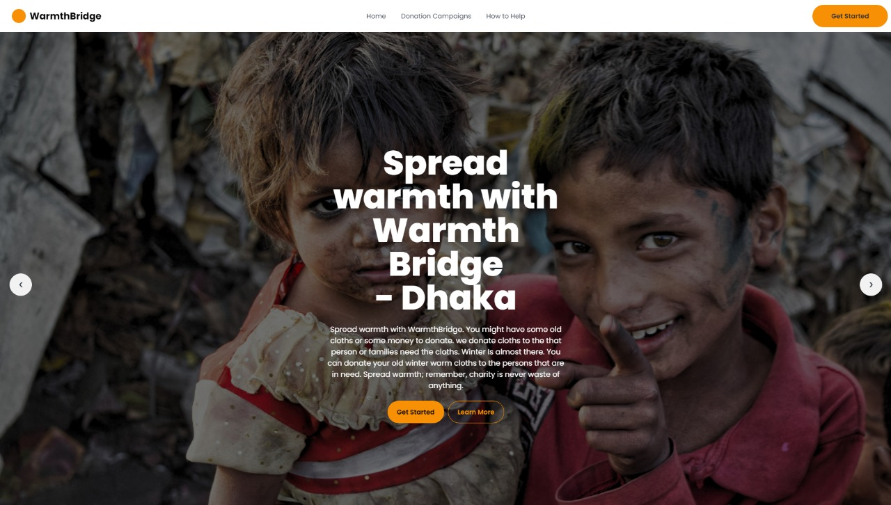

# 🌿 Warmth Bridge  
## Screenshot
<div align="middle">
  
</div>

## 📌 Overview  

**Warmth Bridge** is a donation platform that connects donors with communities in need. Users can donate unused clothing and choose specific campaigns or locations for their contributions. The platform ensures smooth coordination for collection and distribution, helping reach individuals in rural areas.  

🔗 **[Live Project](https://warmth-bridge.web.app/)** 

## 🚀 Technologies Used  

- **Frontend**: React.js, Tailwind CSS, Daisy UI, Flowbite  
- **Backend & Authentication**: Firebase  
- **Routing**: React Router  
- **UI Enhancements**: AOS (Animate on Scroll), React Icons  
- **Notifications**: React Toastify  

## ✨ Core Features  

✅ **User Authentication** (Sign up, Login, Forgot Password)  
✅ **Protected Routes** (Private routes require login)  
✅ **Seamless Navigation** (Redirection to login for unauthorized access)  
✅ **Persistent Sessions** (Users continue where they left off after login)  

## 📦 Dependencies  

```json
"dependencies": {
  "aos": "^2.3.4",
  "firebase": "^9.0.0",
  "daisyui": "^2.51.3",
  "flowbite-react": "^1.3.3",
  "tailwindcss": "^3.0.24",
  "react-router-dom": "^6.3.0",
  "react-icons": "^4.3.1",
  "react-toastify": "^9.0.0"
}
```

## 🛠 How to Run the Project Locally  

1. **Clone the Repository:**  
   ```sh
   git clone https://github.com/tahmidjihan/warmth-bridge.git
   cd warmth-bridge
   ```

2. **Install Dependencies:**  
   ```sh
   npm install
   ```

3. **Set Up Firebase:**  
   - Create a `.env` file and add Firebase credentials.  
   ```env
   REACT_APP_FIREBASE_API_KEY=your_api_key
   REACT_APP_FIREBASE_AUTH_DOMAIN=your_auth_domain
   REACT_APP_FIREBASE_PROJECT_ID=your_project_id
   ```

4. **Run the Development Server:**  
   ```sh
   npm run dev
   ```


## 📎 Resources  

- 🔗 **[Live Project](https://warmth-bridge.web.app/)**  
- 📖 **[Firebase Docs](https://firebase.google.com/docs/)**  
- 🎨 **[Tailwind CSS Docs](https://tailwindcss.com/docs/)**  
- 📌 **[React Router Docs](https://reactrouter.com/docs/en/v6/getting-started/overview)**  

